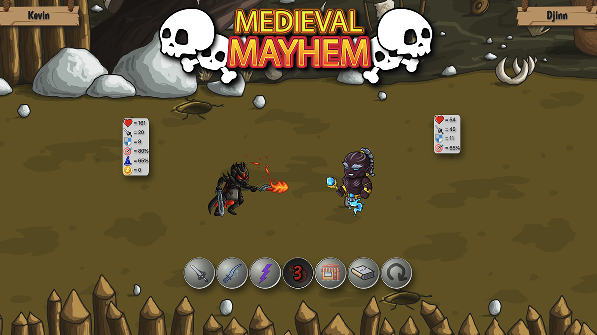
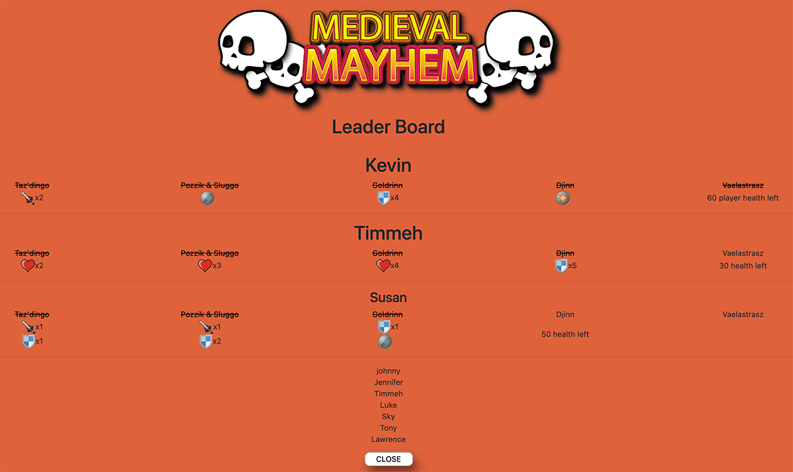
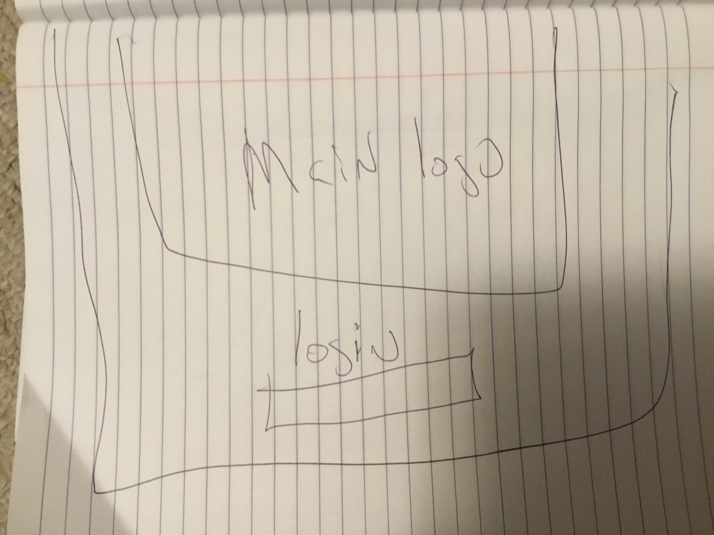
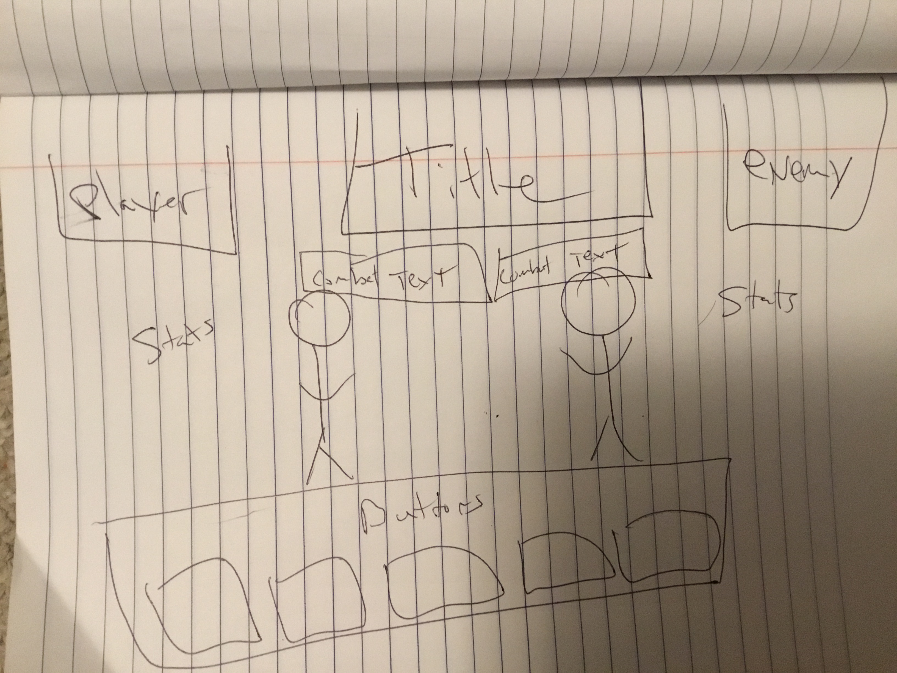
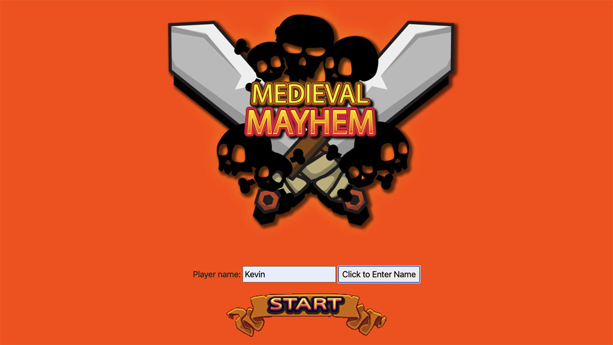
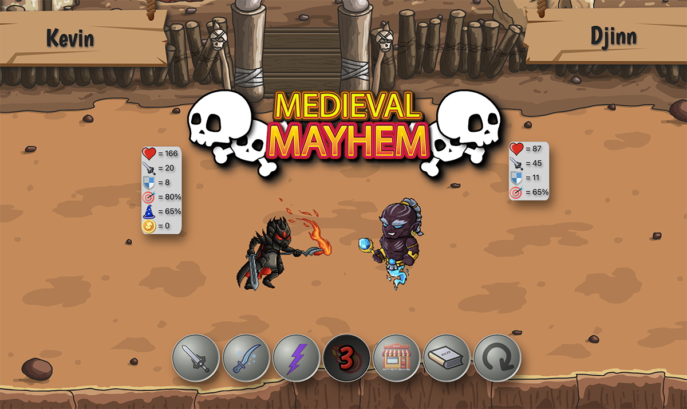

# App Title: Medieval Mayhem

[PLAY Medieval Mayhem](https://kevmathews.github.io/medieval-mayhem/)


---
## Please adjust Zoom on your browser!

### The game is ideally played in the <b>Chrome Browser</b> with zoom set to 100% maybe 125 if you have a large screen.  Zooming in or out can greatly alter the animations so try to adjust zoom so the characters and screen are roughly spaced out like the screen below


## Recent Updates:
5/12/21 - Made game responsive and fully playable on mobile devices.

-Reworked logo graphics

5/11/21 - Pushed beta of Leader Board addition with localStorage.  It tracks everything your character does.  Leader board shows stats on what round items are purchased, how far you got in the game, and your final stats when you either win or lose vs the final boss.  All saved to local storage. 
 


-Next MAJOR update will be early summer 21 with another playable character, and an API to save leader board stats.  Also coming soon are the additions of sound effects as well as more fluid animations.


## Concept:

Medieval Mayhem is a 2d turn based fighting game.  You gain varying amounts of Gold after each round depending on the difficulty of the boss faced. At any time you have the ability to go the the store and purchase health potions, armor upgrades, train skills, or work on your weapon or magical accuracy.  Each round the bosses get progressively tougher, and have different skills sets. Get through all of the bosses in one piece, and you be victorious!

## Technologies Used:

* HTML
* CSS
* JavaScript 
* Bootstrap
* Adobe Photoshop
* Adobe Illustrator

##### Credits:

    Unsplash.com - Crystal clear images with well  
    organized and accurate search results
    
    craftpix.net - MANY sprites for adventure/fantasy  
    games that can be used to animate characters  and events

## Approach:

#### Overview
At the start of development I somewhat confident I could potentially make this game if it just ran in the console. The challange to me, would be bringing it to the DOM and making it visually appealing as well as intuitive.    

#### Wireframe




Color Pallet:

```
    #f15a29
    #dfa53a
    #dadd22
    #5d7a44
    #5f5034
    #000000
    #ffffff
```

#### User stories

As a user I expect to see a game that would be easy to traverse
the layout based on games that previously have looked similar to me.
I dont want to encounter any 'Norman Doors'! Instead I want the user
to be able to see the game and quickly intuitively know how to play.
Regardless of that, there should be a rules button clearly in view 
that will explain how the game is played.  I also expect some sort 
of visual feedback on my actions in the game based on what should 
happen in similar games(IE I push an attack button and I expect to
see character attack and then see the results/feedback of it).

#### Development Plan 

Originally start it as a 2d fighting game with basic DOM elements involved and alerts only nothing animated.
I want to then create and animated sprites to equate to what action is actually happening under the hood, as 
well as to greatly increase the numbers of skills players and enemies have and display visually into the DOM as well.
I want an RPG feel to the game so that you can enhance the character various ways and make the character's attributes
 your own design/creation.

* Development Plan part 1)  get a basic console.log version going
* Development Plan part 2) expand it to include more skills and upgrades
* Development Plan plan 3)  Incorporate visual elements into the DOM 
* Development Plan plan 4)  Enhance visual elements and tweak logic of the game

#### Stretch goals

* Add sound effects!!! Much needed IMO
* Add more skills/upgrades
* Add more bosses and levels 
* Skill and attribute balance, balance and balance some more..
####  Game Screen Shots




## Challenges:

Adding animated sprites to make the fights look impressive and visually much more dynamic.
Creating and adding various modals for some of the game events.
Creating cooldowns for skills.
Making sure intended damage from enemies and enhancements from the Shop append properly.
Trying to make the code as DRY as possible.

### App Demo:  [Medieval Mayhem](https://kevmathews.github.io/medieval-mayhem/)